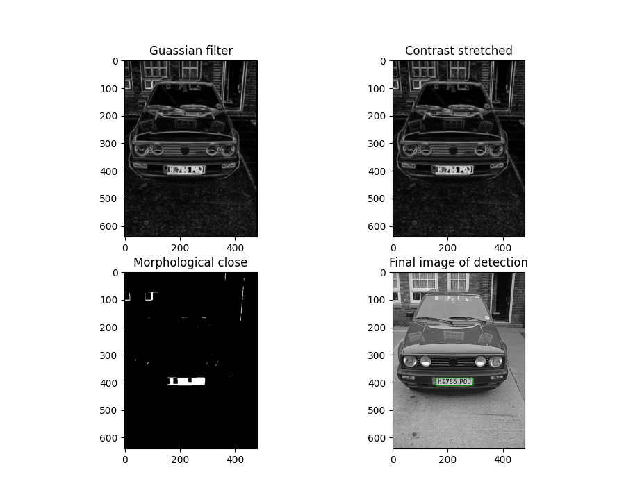

# About

This is a image processing assignment for the course [COMSCI 373](https://courseoutline.auckland.ac.nz/dco/course/COMPSCI/373). The aim of this project is to detect the bounding box around the license plate in an
image of a car. The project also includes an extension script which aims to further extract the characters of the license plate using an OCR algorithm.

# Run
Make sure you have the latest version of pip and python. I tested on python 3.10.2 and beyond.

Install requirements:

```pip install -r requirements.txt```

Run the main program:

```python CS373LicensePlateDetection.py <image_file>.png```

Run the extension program:

```python CS373_extension.py <image_file>.png```

Run on all images with the run script:

```python run.py```

```python run.py -extension```

# Extension Report

For my extension of the license plate detection algorithm, I decided to high level libraries to speed up the algorithm such as opencv and numpy. For reading the text I used easyocr which installed an optical character recognition modal that could read the text and output it to the console.

I created a separate python file named “CS373_extension.py”. I copied the code over from the main part of the assignment and continued building off it. Areas that needed optimization was the morphological closing step. I utilized opencv morphological close method. This first required conversion of the exiting 2d array into a numpy array of type uint8, for opencv to consume. This greatly improved the speed of this step. I found that 5 iterations of the morphological close was sufficient to highlight the license plate well. It also improved the bounding box location accuracy.

Using the connected components algorithm from the main task the bounding box was found. Converting the grey image into a numpy array I was able to crop it the size of the bounding box. The resulting numpy array is then fed into easyocr which gave semi-accurate results. The biggest limitation of the OCR model was the resolution of the cropped image.

The next step was to analyse the cropped image and extract any text from it. The easyocr library would automatically download the English character pretrained model before use. Some licence plates produced desired results; others however were mixed. It successfully detected the correct license numbers on images 6, 2 and 3. Plate 3 included the “Texas” text within it aswell which is not the fault of the model. For the other plates the model would get a single character wrong. This was probably due to low resolution of the cropped image.

Further improvements could include, speeding up the standard deviation calculation as this is the slowest part of the program. Opencv lacks a dedicated standard deviation filter method, so I kept it the same from the main task.

## Results



# Technologies

- [matplotlib](https://github.com/matplotlib/matplotlib) for plotting output.
- [numpy](https://github.com/numpy/numpy) for numerical computation.
- [opencv](https://github.com/opencv/opencv-python) for image processing.
- [easy-ocr](https://github.com/JaidedAI/EasyOCR) english OCR algorithm.